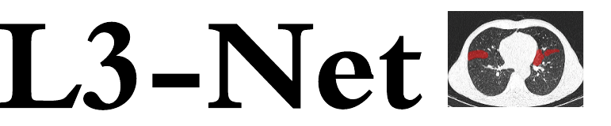
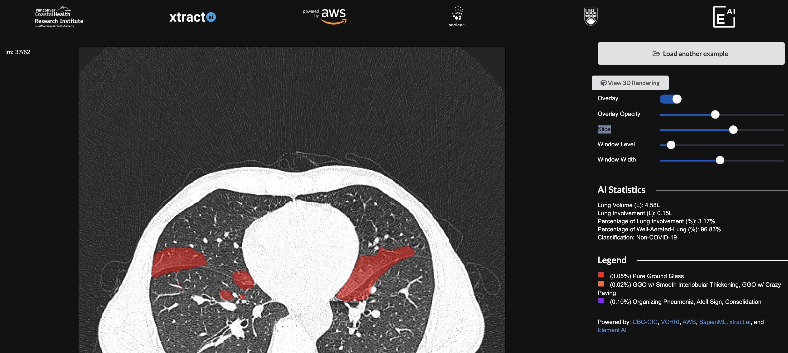
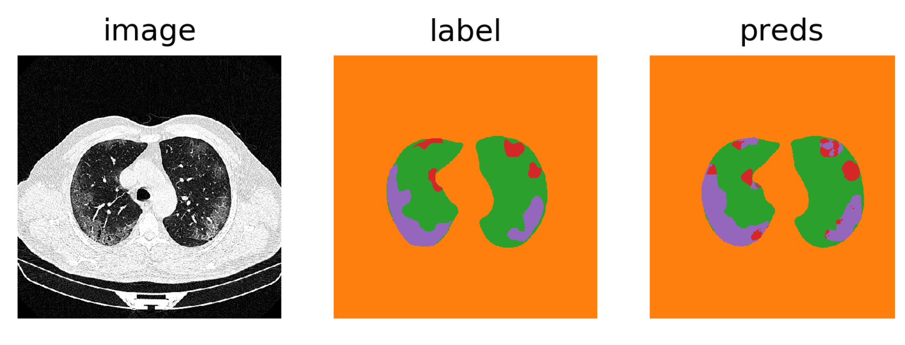
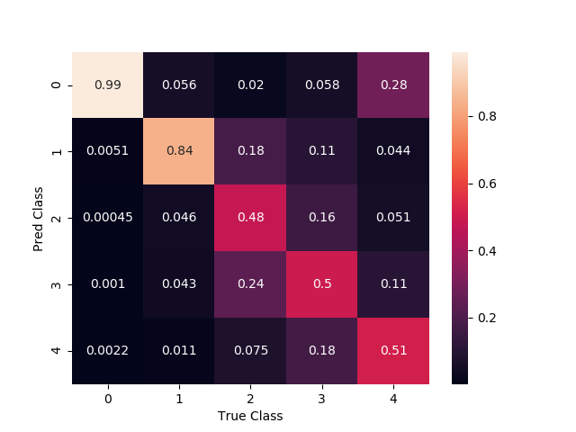
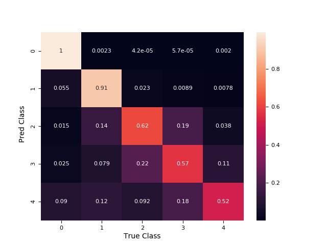
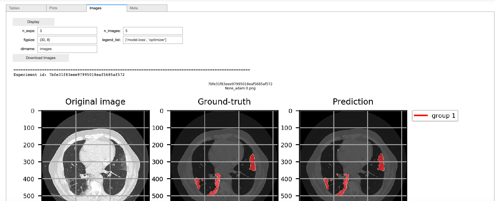

<p align="center">

</p>

--------------------------------------------------------------------------------

L3-Net is an open source segmentation and classification model for analyzing COVID-19 infections in chest CT-Scans. The percentage of lung involvement is a valuable metric that is difficult to accurately measure without advanced software tools. We hope that utilizing a machine to accurately calculate the lung involvement ratio and absolute volume will be a valuable metric for researchers to use to prognosticate patients with COVID-19 and other respiratory illnesses. Recent literature suggests that the percentage of Well-Aerated-Lung correlates to clinical outcomes, such as the need for ventilator support, ICU admission and death.

|Index| Description|
|:----------------|:-----------|
| [Demo](#demo)         |     Interact with L3-Net's predictions on a set of CT-Scans.    | 
| [Overview](#overview)         |     See the motivation behind this project.    | 
| [Experiments](#experiments)         |    Download our weights and run experiments. |
| [Timeline](#timeline)       |     Checkout our plans.   |
| [Authors](#authors)      |     Meet the team behind this.     |
| [Changelog](#changelog)      |     History of what has changed.     |
| [License](#license)      |     License details.     |

# Demo
Visit the link to the [demo](https://cic.ubc.ca/projects/open-source-ai-model-for-covid-19-ct-diagnostics-and-prognosis/covid-19-ai-tool-demo/) and display L3-Net's predictions on a variety of CT-Scans. 
This demo displays the predictions from our 2D UNet model on a random sampling of our test set after they have been processed using an automatically generated mask. This mask is calculated by finding the two largest connected components in the predictions for the entire scan, which correspond to the right and left lung with a high probability.

<p align="center">

A snapshot from the demo showing infected regions on a ct-scan slice.
</p>

# Overview

We have worked with health centers around the world to put together one of the largest international COVID19 chest CT scan datasets.  By making the model architectures, training routines, and pre-trained weights available, we are hoping to make this model digestable for researchers and health centres around the world. This repository will contain code and weights for networks that we have trained for the segmentation and classification of COVID19 using a variety of 2D and 3D architectures. Labelling is an ongoing process, so as we continue to collect and annotate new data we will update this repository with our latest models.

At this time we have collected over 3,000 chest CT scans from around the world, of which our team of expert radiologists have currently labelled 24,975 slices from 663 scans. The initial release for L3-net are trained 2D U-Net and PSPNet segmentation models which will be used as baselines for future releases of more sophistacted architectures.  A classifier for the probability of COVID-19 infection will come shortly afterwards.  As we receive more clinical data, we will begin correlating the output of our segmentation with real world outcomes, and provide new classifiers as part of a larger, all-encompassing prognostication model. 

For a more detailed description for the goals of this project, please visit the [project splash page](https://cic.ubc.ca/projects/open-source-ai-model-for-covid-19-ct-diagnostics-and-prognosis).

## Background

L3-net is not simply another COVID-19 detection model.  We wanted to empower medical personnel with tools that would augment their ability to make decisions involving COVID-19 patients.  L3-net is a clinically relevant approach to AI in medicine and is a continually evolving project that aims to provide quantitative measurements to radiologists.  The team behind L3-net has worked closely with radiologists to identify the features and characteristics in CT scans that correlate most strongly with poor outcomes in patients.  Every facet of the model has grown organically from the needs of the radiologists involved with this project.


## Dataset Statistics

Slices from the scans have been annotated by a team of radiologists using MD.ai to segment 6 types of pulmonary opacifications associated with COVID19, as well as each lung node and 2 types of non-pulmonary findings. The occurance of each type of opacification is not mutually exlusive, so we have currently created three clinically relevant groupings that we aim to segment with our model. We create these groupings because in general the severity of the infection increases from class 5 - 10 so it is clinically relevant to compute the volume of the lung that is infected with each grouping.

|  Opacification Type  | Class ID | Group ID
|:--------------|---------:|------------:|
| Background |  0   |  0  |
| Left Lung |  1   |  1  |
| Right Lung |  2   |  1  |
| Pleural Effusion |  3   |  0  |
| Lymphadenopathy |  4   |  0  |
| Pure Ground Glass Opacification (GGO) |  5  | 2  |
| GGO w/ Smooth Interlobular Septal Thickening |  6  |  3  |
| GGO w/ Intralobular Lines (Crazy Paving) |  7  |  3  |
| Organizing Pneumonia Pattern |  8  |  4  |
| GGO w/ Peripheral Consolidation (Atoll Sign) |  9  |  4  |
| Consolidation|  10  |  4  |


We are currently labeling new datasets that have come in from China, Italy, South Korea, and Canada, totalling over 3000 more studies to be added to the dataset below.  The new data contains significantly more thin-slice data, which has taken our labellers more time to work through.  

As of May 12, 2020, the dataset used for training the supplied weights consists of:

|       Annotated Data By Region - Slices(Scans)       | Test | Val | Train 
|:--------------|---------:|------------:|----------:|
| Iran         |    1852 (52) |       2645 (95)|    12365 (405)|
| Italy        |      75 (1) |          0 (0)|        0 (0)|
| South Korea  |    1568 (18) |       1151 (20)|     3255 (51) |
| Vancouver    |    1407 (13)|          0 (0)|        0 (0)|
| Saudi Arabia |       0 (0)|         69 (1) |      589 (7) |
| **Total**        |    **4902 (84)** |       **3865 (116)** |    **16208 (463)** |
---
|       Scanner Manufacturer      | Count |
|:--------------|---------:|
| Toshiba       |    2
| Siemens      |    547
| GE       |    96
---
|       Patient Sex      | Count |
|:--------------|---------:|
| Female       |    321
| Male    |    324
---
|       Slice Thickness      | Count |
|:--------------|---------:|
| 1 mm       |    112
| 5 mm    |    84
| 10 mm    |    449
---

# 2. Models


---

## 2D UNet


<em>A comparison of predictions with a radiologist's annotation from the test set, displaying the model's predictions for the distribution of Group 1 (Red) and Group 2 (Purple).*</em>

This model was was pre-trained on the [LUNA16](https://luna16.grand-challenge.org/data/) dataset to segment lung regions. We then reset the output layer of the model and extend it to 5 classes, and then train the model on our train split outlined above. The weights provided come from the best model selected using our validation set, and score an opacity IOU of 0.76 on our test set for groups 3,4, and 5 combined. We combine these groups in order to evalaute the ability of the model to segment the volume of opacification. We evaluate the accuracy of our model to differentiate between the opacification types using a confusion matrix. We see there is often confusion between the different opacity types. An example of this is shown in the figure above, where the confusion between Group 1 and Group 2 leads to poor qualitative results, however a radiologist has confirmed that this segmentation is qualitatively valid due to the fact that the classes are not mutually exclusive. We believe there is still signifigant room for improvement as we collect more data and train more sophisticated models.



---

## PSPNet w/ InceptionResNetv2 Encoder 


In addition to the 2D UNet, we are releasing the weights for a trained Pyramid Scene Parsing Network (PSPNet) using the InceptionResNetv2 as the encoder for extracting image features. The weights were trained and tested on non-overlapping subsets of the dataset described above. The PSPNet developed by Zhao et al. (2016) (https://arxiv.org/abs/1612.01105) uses a pyramid pooling module to extract global context information. The Segmentation Models Pytorch repository by Yakubovskiy (2019) (https://github.com/qubvel/segmentation_models.pytorch) for rapid prototyping. The PSPNet achieved a combined opacity IOU of 0.70 on our test set, but achieved higher accuracies with respect to differentiating between different opacity types. As mentioned above, opacity types are not mutually exclusive, and inter-observer variability in classifying opacity types proves to be a challenge. 



# Experiments
Due to privacy restrictions we are unable to release our data, however for your convenience we have included this demonstration of how to load our pre-trained models and fine tune them on publically available data. Our models were trained on DICOM files that use Houndsfield Units, which were clipped to a lung window between -1000 and 50 Hu. These publically available scans have been converted to images and are no longer in DICOM format or Houndsfield Units, so we need to first fine tune the model to account for the distribution shift. The open source scans have only been labelled for ground glass opacification and consolidation.

## 3.1 Install dependencies

```

pip install -r requirements.txt

```

This command installs the required packages the [Haven library](https://github.com/ElementAI/haven) which helps in managing the experiments.

## 3.2 Run Experiments


### i. Download the open-source covid dataset

This dataset was supplied by MedicalSegmentation.com.  We have transformed their NIFTI files to DCM and their masks into PNGs and supplied a dataloader for this set.  We've included this as a way to get our repository up and running and tested against something right away!

Download link: https://s3.ca-central-1.amazonaws.com/ubccic.covid19.models/L3netDemoData.zip

Extract this .zip exactly the way it is into a folder of your choice.

### ii. Download our model weights

Download our weights and put them into the `checkpoints` directory in the repository.

UNet2D Weights : https://s3.ca-central-1.amazonaws.com/ubccic.covid19.models/unet2d_aio_pre_luna.ckpt

PSPNet Weights : https://s3.ca-central-1.amazonaws.com/ubccic.covid19.models/pspnet_aio_lungwindow_1channel.ckpt

### iii. Run training and validation

```
python trainval.py -e open_source_<model> -d <datadir> -sb <savedir_base> -r 1
```

- `-e open_source_<model>` specifies the hyper-parameters, which can be changed in `exp_configs.py`. Specify either `unet2d` or `pspnet` for `<model>` to hot start with on of our pre-trained models.

- `<model>` is the architecture to run, either `unet2d` or `pspnet`.

- `<datadir>` is where the dataset is located.

- `<savedir_base>` is where the experiment weights and results will be saved.


##  3.3 View Results

### i. Launch Jupyter from terminal

```
> jupyter nbextension enable --py widgetsnbextension --sys-prefix
> jupyter notebook
```

###  ii. Run the following from a Jupyter cell

```python
from haven import haven_jupyter as hj
from haven import haven_results as hr
from haven import haven_utils as hu

# path to where the experiments got saved
savedir_base = <savedir_base>

# filter exps
filterby_list = [('dataset.name','covid')]

# get experiments
rm = hr.ResultManager(savedir_base=savedir_base, 

                      filterby_list=filterby_list, 

                      verbose=0)

# dashboard variables
legend_list = ['model.base']
title_list = ['dataset', 'model']
y_metrics = ['iou_group0', 'iou_group1']

# launch dashboard
hj.get_dashboard(rm, vars(), wide_display=True)
```

This script outputs the following dashboard



##  3.4 Test your trained models
During training the best models for each exp_id are saved automatically. To run inference with the model you trained above simply run:

```python
python test.py -e open_source_<model> -d <datadir> -sb <savedir_base>
```

Or specify a different model checkpoint:
```python
python test.py -e open_source_<model> -d <datadir> -sb <savedir_base> -p <model_checkpoint>
```


# Timeline

 - [x] May 12, 2020 - Alpha prototype v0.1 release on Github

 - [ ] June 2020 - Beta Prototype v0.9 release with locally deployable server implementation

 - [ ] July 2020 - Publish development process in medical and AI journals

 - [ ] August 2020 - Official Model Release v1.0

 - [ ] October 2020 - Prognostication Model Release v2.0

 - [ ] June 2021 - Health Canada Approval Attempt
 
# Authors

The key contributors to this repository are Keegan Lensink, Issam Laradji, and Marco Law.  Other members of the team include Paolo Emilio Barbanos, a Senior Machine Learning Engineer from the AWS Machine Learning team and Brian Lee of Sapien ML.

# Changelog

 - May 12, 2020:  Initial release, segmentation models and weights
 
## License
 
This project is distributed under the [Apache License 2.0](https://github.com/UBC-CIC/vgh-covid-19-ct-model/blob/master/LICENSE)
